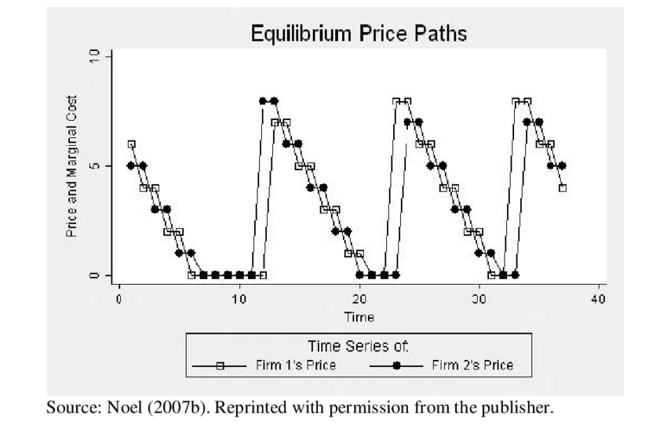
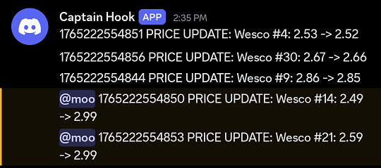
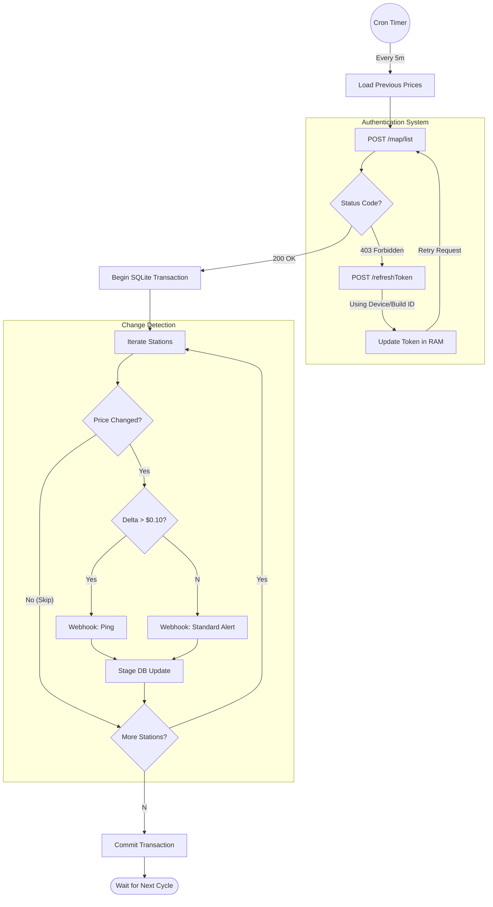
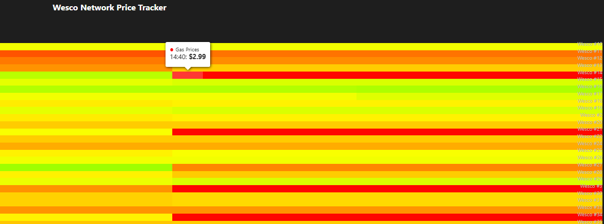

# GasWatchdog

Fill up your car at the lowest possible price in Michigan and beat the Edgeworth Price Cycle by recieving notifications when prices are about to skyrocket!

## API Requests
Implemented an automatic token rotation system. If the API returns a 403 Forbidden, the script intercepts the error, hits the /refreshToken endpoint using the device fingerprint, updates the in-memory session, and retries the original request without crashing.

Fetch Wesco API to detect gas price increases in Michigan since they love to increase by 50 cents or more overnight due to midwest price cycling

API found by reverse engineering the wesco android app, may add other stations in the future

Once the first price change is detected, you usually have a few hours to get gas before it spikes 50 cents or more at your local station unless the first change happened to be your station.

Web page is experimental/laggy but you can see it at https://gas.moomoo.me

## Config options
Nothing should have to be changed besides webhook url unless the API gets updated. The DEVICE UID can be any random string.